<!-- ═══════════════════════════════ HEADER ═══════════════════════════════ -->


<!-- ═══════════════════════════ TYPING SUBTITLE ═══════════════════════════ -->

<p align="center">
  <a href="https://git.io/typing-svg">
    
  </a>
</p>

<!-- ═══════════════════════════ SOCIAL BADGES ═══════════════════════════ -->

<p align="center">
  <a href="https://linkedin.com/in/YOUR_LINKEDIN_HERE"></a>&nbsp;
  <a href="mailto:YOUR_EMAIL_HERE"></a>&nbsp;
  <a href="https://leetcode.com/YOUR_LEETCODE"></a>&nbsp;
  <a href="https://github.com/Priyanshu123a19"></a>&nbsp;
  
</p>

<!-- ═══════════════════════════ CLI TERMINAL ═══════════════════════════ -->

<br/>

<div align="center">
  
</div>

<br/>

<!-- ═══════════════════════ TECH STACK SECTION ═══════════════════════ -->


<table align="center">
  <tr>
    <td align="center" width="140"><b>🤖 AI Core</b></td>
    <td>
      
      
      
      
      
      
      
    </td>
  </tr>
  <tr>
    <td align="center"><b>🔗 APIs</b></td>
    <td>
      
      
      
      
      
    </td>
  </tr>
  <tr>
    <td align="center"><b>🗄️ Data</b></td>
    <td>
      
      
      
      
      
    </td>
  </tr>
  <tr>
    <td align="center"><b>🐳 Infra</b></td>
    <td>
      
      
      
      
      
    </td>
  </tr>
</table>

<br/>

<!-- ═══════════════════════ PROJECTS SECTION ═══════════════════════ -->


<br/>

<!-- PROJECT: ORBIT -->
<details>
<summary>🛡️ <b>ORBIT</b> — Cybersecurity Intelligence Pipeline &nbsp;</summary>
<br/>
<blockquote>
<b>[Internship @ Data Legos]</b> LangGraph-based multi-agent pipeline serving community banks.
Evaluated NEAR AI Cloud TEE through systematic EXP-001 → EXP-010 experiments. Designed three-tier architecture (NEAR AI TEE + AuraDB + Wazuh Cloud).
</blockquote>
<p>
  
  
  
  
</p>
</details>

<!-- PROJECT: LexRAG -->
<details>
<summary>⚖️ <b>LexRAG</b> — Legal Document Intelligence System &nbsp;</summary>
<br/>
<blockquote>
Production-grade legal AI implementing <b>5 research papers</b> (HyDE, CRAG, Self-RAG, RAPTOR, Speculative RAG) with original innovations — a 4-path Adaptive Retrieval Router and a Legal Conflict Detection agent using NLI cross-encoder. ChromaDB + Neo4j with write-back.
</blockquote>
<p>
  
  
  
  
</p>
</details>

<!-- PROJECT: Elixir -->
<details>
<summary>🏥 <b>Elixir</b> — Medical AI Pipeline &nbsp;</summary>
<br/>
<blockquote>
Fully dockerized multi-microservice medical AI with <b>10 A2A protocol agents</b>, clinical safety validators (MEWS Scoring, Prescription Safety Validator), LATS tree search, Self-RAG with self-grading loop, MCP server integrations (ICD-11, PubMed, Medical Calculator), and LangSmith + OpenTelemetry + RAGAS evaluation.
</blockquote>
<p>
  
  
  
  
</p>
</details>

<!-- PROJECT: GraphRAG -->
<details>
<summary>🔍 <b>Enterprise GraphRAG</b> — Hybrid RAG System &nbsp;</summary>
<br/>
<blockquote>
Hybrid GraphRAG + Classic RAG pipeline with Query Enriching Agent, Schema Grounding Agent, Cypher generation with fuzzy resolution, Cache Agent. Powered by BGE embeddings + cross-encoder reranking on Neo4j AuraDB + ChromaDB + Redis.
</blockquote>
<p>
  
  
  
  
</p>
</details>

<br/>

<!-- ═══════════════════════ STATS SECTION ═══════════════════════ -->


<br/>

<p align="center">
  
  
</p>

<p align="center">
  
</p>

<div align="center">
  
</div>


<br/>

<!-- ═══════════════════════ CURRENTLY SECTION ═══════════════════════ -->


<br/>

```yaml
# ~/.config/priyanshu/status.yaml

building:
  project: "ORBIT — LangGraph cybersec pipeline"
  role: "Agentic AI Dev Intern @ Data Legos"
  stack: [LangGraph, FastAPI, Neo4j, Docker]

learning:
  dsa: "Striver's A2Z Sheet → Binary Trees & BFS patterns"
  book: "AI Engineering by Chip Huyen"
  experimenting: "MedGemma 4B quantized (local inference playground)"

shipping:
  - "LexRAG: 5-paper legal RAG with adaptive routing"
  - "Elixir: 10-agent medical AI with clinical validators"
  - "GraphRAG: Hybrid graph + classic RAG with Cypher gen"

philosophy: "I build systems where agents think, plan & act — not just chat."
```

<br/>

<!-- ═══════════════════════ CONNECT ═══════════════════════ -->

<p align="center">
  <i>Open to discuss multi-agent architectures, LangGraph patterns, RAG system design, or anything AI engineering.</i>
</p>

<p align="center">
  <a href="https://linkedin.com/in/YOUR_LINKEDIN_HERE">
    
  </a>
</p>

<!-- ═══════════════════════ FOOTER ═══════════════════════ -->


